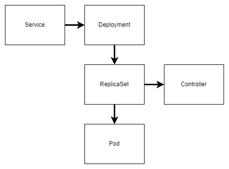
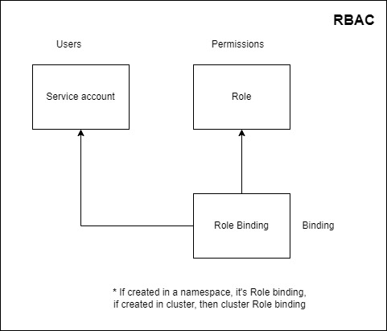

# K8s_practice

Notes on hands-on practice Kubernetes

## Table of Content

- [The beginning](#the-beginning)
- [Auto-scaling, Auto-healing](#auto-scaling-auto-healing)
- [Kubernetes Service](#kubernetes-service)
- [Ingress](#ingress)
- [ConfigMaps & Secrets](#configmaps--secrets)
- [RBAC](#rbac)
- [Monitoring with Prometheus & Grafana](#monitoring-with-prometheus--grafana)

## The beginning

Basic Architecture of Kubernetes, Master - Node system / Control Plane - Data Plane system

| Control Plane            | Data Plane        |
|--------------------------|-------------------|
| kube-apiserver           | kubelet           |
| etcd                     | kube-proxy        |
| kube-scheduler           | Container runtime | 
| kube-controller-manager  |                   |
| cloud-controller-manager |                   |

Basic workflow of Kubernetes



### Pod

Install `kubectl` and `minikube` following the official
[doc](https://kubernetes.io/docs/tasks/tools/) suitable for your platform.

Next, create a local cluster using `minikube` from the CLI

```
minikube start
```

Confirm that the cluster is running by

```
$ kubectl get nodes
NAME       STATUS   ROLES           AGE     VERSION
minikube   Ready    control-plane   6m44s   v1.30.0
```

Alternatively, you can use

```
$ kubectl get po -A
NAMESPACE     NAME                               READY   STATUS    RESTARTS      AGE
kube-system   coredns-7db6d8ff4d-wq2dc           1/1     Running   0             20m
kube-system   etcd-minikube                      1/1     Running   0             20m
kube-system   kube-apiserver-minikube            1/1     Running   0             20m
kube-system   kube-controller-manager-minikube   1/1     Running   0             20m
kube-system   kube-proxy-lhxd5                   1/1     Running   0             20m
kube-system   kube-scheduler-minikube            1/1     Running   0             20m
kube-system   storage-provisioner                1/1     Running   1 (20m ago)   20m
```

Now, create a file [pod.yml](./pod.yml) and paste the below

```
apiVersion: v1
kind: Pod
metadata:
  name: nginx
spec:
  containers:
  - name: nginx
    image: nginx:1.14.2
    ports:
    - containerPort: 80
```

We will create our first pod now

```
$ kubectl create -f pod.yml
pod/nginx created
```

Let's get the newly created pod

```
$ kubectl get pods
NAME    READY   STATUS    RESTARTS   AGE
nginx   1/1     Running   0          4m50s
```

If we want more details, we can do

```
$ kubectl get pods -o wide
NAME    READY   STATUS    RESTARTS   AGE     IP           NODE       NOMINATED NODE   READINESS GATES
nginx   1/1     Running   0          5m37s   10.244.0.3   minikube   <none>           <none>
```

we can log in to the pod and check using `curl`

```
$ minikube ssh
docker@minikube:~$ curl 10.244.0.3
<!DOCTYPE html>
<html>
<head>
<title>Welcome to nginx!</title>
<style>
    body {
        width: 35em;
        margin: 0 auto;
        font-family: Tahoma, Verdana, Arial, sans-serif;
    }
</style>
</head>
<body>
<h1>Welcome to nginx!</h1>
<p>If you see this page, the nginx web server is successfully installed and
working. Further configuration is required.</p>

<p>For online documentation and support please refer to
<a href="http://nginx.org/">nginx.org</a>.<br/>
Commercial support is available at
<a href="http://nginx.com/">nginx.com</a>.</p>

<p><em>Thank you for using nginx.</em></p>
</body>
</html>
```

Get the details of the specific pod

```
 kubectl describe pod nginx
Name:             nginx
Namespace:        default
Priority:         0
Service Account:  default
Node:             minikube/192.168.49.2
Start Time:       Sat, 10 Aug 2024 01:06:56 +0600
Labels:           <none>
Annotations:      <none>
Status:           Running
IP:               10.244.0.4
IPs:
  IP:  10.244.0.4
Containers:
  nginx:
    Container ID:   docker://50292041f0935f3366794342e725974dd6e9071349290f6852236db94aa92a2e
    Image:          nginx:1.14.2
    Image ID:       docker-pullable://nginx@sha256:f7988fb6c02e0ce69257d9bd9cf37ae20a60f1df7563c3a2a6abe24160306b8d
    Port:           80/TCP
    Host Port:      0/TCP
    State:          Running
      Started:      Sat, 10 Aug 2024 01:06:56 +0600
    Ready:          True
    Restart Count:  0
    Environment:    <none>
    Mounts:
      /var/run/secrets/kubernetes.io/serviceaccount from kube-api-access-nqc6j (ro)
Conditions:
  Type                        Status
  PodReadyToStartContainers   True
  Initialized                 True
  Ready                       True
  ContainersReady             True
  PodScheduled                True
Volumes:
  kube-api-access-nqc6j:
    Type:                    Projected (a volume that contains injected data from multiple sources)
    TokenExpirationSeconds:  3607
    ConfigMapName:           kube-root-ca.crt
    ConfigMapOptional:       <nil>
    DownwardAPI:             true
QoS Class:                   BestEffort
Node-Selectors:              <none>
Tolerations:                 node.kubernetes.io/not-ready:NoExecute op=Exists for 300s
                             node.kubernetes.io/unreachable:NoExecute op=Exists for 300s
Events:
  Type    Reason     Age   From               Message
  ----    ------     ----  ----               -------
  Normal  Scheduled  39m   default-scheduler  Successfully assigned default/nginx to minikube
  Normal  Pulled     39m   kubelet            Container image "nginx:1.14.2" already present on machine
  Normal  Created    39m   kubelet            Created container nginx
  Normal  Started    39m   kubelet            Started container nginx
```

Print the logs for a pod

```
$ kubectl logs nginx
```

As we are done with the pod, let's delete it

```
$ kubectl get pods -o wide
NAME    READY   STATUS    RESTARTS   AGE   IP           NODE       NOMINATED NODE   READINESS GATES
nginx   1/1     Running   0          14m   10.244.0.3   minikube   <none>           <none>
$ kubectl delete pod nginx
pod "nginx" deleted
```

## Auto-scaling, Auto-healing

### Deployment

AS of Pods, they can be compared to a single Docker containers. For autoscaling,
we will be using `deployments`. Let's create another file,
[deployment.yml](./deployment.yml) and put the below definition

```
apiVersion: apps/v1
kind: Deployment
metadata:
  name: nginx-deployment
  labels:
    app: nginx
spec:
  replicas: 3
  selector:
    matchLabels:
      app: nginx
  template:
    metadata:
      labels:
        app: nginx
    spec:
      containers:
      - name: nginx
        image: nginx:1.14.2
        ports:
        - containerPort: 80
```

Let's spin up the deployment

```
$ kubectl create -f deployment.yml 
deployment.apps/nginx-deployment created
```

Alternately, we can get the same by

```
$ kubectl apply -f deployment.yml 
deployment.apps/nginx-deployment created
```

List the deployment

```
$ kubectl get deploy             
NAME               READY   UP-TO-DATE   AVAILABLE   AGE
nginx-deployment   3/3     3            3           9m55s
```

List the ReplicaSet

```
 kubectl get rs  
NAME                          DESIRED   CURRENT   READY   AGE
nginx-deployment-77d8468669   3         3         3       10m

```

And list the pods

```
$ kubectl get pods
NAME                                READY   STATUS    RESTARTS   AGE
nginx-deployment-77d8468669-2cnhp   1/1     Running   0          10m
nginx-deployment-77d8468669-9dcqk   1/1     Running   0          10m
nginx-deployment-77d8468669-czxg2   1/1     Running   0          10m
```

Now, open another terminal and watch for the pods

```
$ kubectl get pods -w            
NAME                                READY   STATUS    RESTARTS   AGE
nginx-deployment-77d8468669-2cnhp   1/1     Running   0          18m
nginx-deployment-77d8468669-9dcqk   1/1     Running   0          18m
nginx-deployment-77d8468669-czxg2   1/1     Running   0          18m
```

From the first terminal, delete one pod

```
$ kubectl delete pod nginx-deployment-77d8468669-2cnhp
pod "nginx-deployment-77d8468669-2cnhp" deleted
```

Now, if you list again the pods after some time, you will get 3 pods but one with a new name

```
$ kubectl get pods                                    
NAME                                READY   STATUS    RESTARTS   AGE
nginx-deployment-77d8468669-9dcqk   1/1     Running   0          21m
nginx-deployment-77d8468669-czxg2   1/1     Running   0          21m
nginx-deployment-77d8468669-ht2kj   1/1     Running   0          60s
```

And the watch log

```
$ kubectl get pods -w            
NAME                                READY   STATUS    RESTARTS   AGE
nginx-deployment-77d8468669-2cnhp   1/1     Running   0          18m
nginx-deployment-77d8468669-9dcqk   1/1     Running   0          18m
nginx-deployment-77d8468669-czxg2   1/1     Running   0          18m
nginx-deployment-77d8468669-2cnhp   1/1     Terminating   0          20m
nginx-deployment-77d8468669-ht2kj   0/1     Pending       0          0s
nginx-deployment-77d8468669-ht2kj   0/1     Pending       0          0s
nginx-deployment-77d8468669-ht2kj   0/1     ContainerCreating   0          0s
nginx-deployment-77d8468669-2cnhp   0/1     Terminating         0          20m
nginx-deployment-77d8468669-ht2kj   1/1     Running             0          1s
nginx-deployment-77d8468669-2cnhp   0/1     Terminating         0          20m
nginx-deployment-77d8468669-2cnhp   0/1     Terminating         0          20m
nginx-deployment-77d8468669-2cnhp   0/1     Terminating         0          20m
```

Let's increase the replicas from 3 to 5. update line 8 from `replicas: 3`
to `replicas: 5` in the file [deployment.yml](./deployment.yml), and apply
the change

```
$ kubectl apply -f deployment.yml
deployment.apps/nginx-deployment configured
```

On second terminal, we will get,

```
$ kubectl get pods -w            
NAME                                READY   STATUS    RESTARTS   AGE
nginx-deployment-77d8468669-2cnhp   1/1     Running   0          18m
nginx-deployment-77d8468669-9dcqk   1/1     Running   0          18m
nginx-deployment-77d8468669-czxg2   1/1     Running   0          18m
nginx-deployment-77d8468669-2cnhp   1/1     Terminating   0          20m
nginx-deployment-77d8468669-ht2kj   0/1     Pending       0          0s
nginx-deployment-77d8468669-ht2kj   0/1     Pending       0          0s
nginx-deployment-77d8468669-ht2kj   0/1     ContainerCreating   0          0s
nginx-deployment-77d8468669-2cnhp   0/1     Terminating         0          20m
nginx-deployment-77d8468669-ht2kj   1/1     Running             0          1s
nginx-deployment-77d8468669-2cnhp   0/1     Terminating         0          20m
nginx-deployment-77d8468669-2cnhp   0/1     Terminating         0          20m
nginx-deployment-77d8468669-2cnhp   0/1     Terminating         0          20m
nginx-deployment-77d8468669-w87p5   0/1     Pending             0          1s
nginx-deployment-77d8468669-w87p5   0/1     Pending             0          1s
nginx-deployment-77d8468669-qmfr5   0/1     Pending             0          0s
nginx-deployment-77d8468669-qmfr5   0/1     Pending             0          0s
nginx-deployment-77d8468669-w87p5   0/1     ContainerCreating   0          1s
nginx-deployment-77d8468669-qmfr5   0/1     ContainerCreating   0          0s
nginx-deployment-77d8468669-qmfr5   1/1     Running             0          0s
nginx-deployment-77d8468669-w87p5   1/1     Running             0          1s
```

List all the pods now,

```
$ kubectl get pods                                    
NAME                                READY   STATUS    RESTARTS   AGE
nginx-deployment-77d8468669-9dcqk   1/1     Running   0          29m
nginx-deployment-77d8468669-czxg2   1/1     Running   0          29m
nginx-deployment-77d8468669-ht2kj   1/1     Running   0          9m2s
nginx-deployment-77d8468669-qmfr5   1/1     Running   0          86s
nginx-deployment-77d8468669-w87p5   1/1     Running   0          87s
```

Ok, we are done with the deployment for now, let's destroy what we've created!!

```
$ kubectl delete -f deployment.yml                                                                                                                                      
deployment.apps "nginx-deployment" deleted
```

## Kubernetes Service

### Cluster IP mode

only accessible from the same network/cluster

### Node Port mode

only accessible from organization

### Load Balancer mode

open to world

Let's create a deployment for the application in the file
[app_deployment.yml](./app_deployment.yml) as below

```
apiVersion: apps/v1
kind: Deployment
metadata:
  name: python-app
  labels:
    app: python-app
spec:
  replicas: 3
  selector:
    matchLabels:
      app: python-app
  template:
    metadata:
      labels:
        app: python-app
    spec:
      containers:
      - name: fast-app
        image: ahmadalsajid/fast-app:latest
        ports:
        - containerPort: 8000
```

Spin up the deployment via

```
$  kubectl create -f app_deployment.yml
deployment.apps/python-app created
```

Now, let's create a service for this in [app_service.yml](./app_service.yml) file for NodePort mode.

```
apiVersion: v1
kind: Service
metadata:
  name: python-app-k8s-service
spec:
  type: NodePort
  selector:
    app: python-app
  ports:
    - port: 80
      targetPort: 8000
      nodePort: 30007
```

And create it by

```
$ kubectl apply -f app_service.yml 
service/python-app-k8s-service created
```

Check it with

```
$  kubectl get svc -v=7
I0810 20:12:09.709775    1847 loader.go:395] Config loaded from file:  /home/sajid/.kube/config
I0810 20:12:09.710265    1847 cert_rotation.go:137] Starting client certificate rotation controller
I0810 20:12:09.712302    1847 round_trippers.go:463] GET https://127.0.0.1:52630/api/v1/namespaces/default/services?limit=500
I0810 20:12:09.712326    1847 round_trippers.go:469] Request Headers:
I0810 20:12:09.712350    1847 round_trippers.go:473]     Accept: application/json;as=Table;v=v1;g=meta.k8s.io,application/json;as=Table;v=v1beta1;g=meta.k8s.io,application/json
I0810 20:12:09.712357    1847 round_trippers.go:473]     User-Agent: kubectl/v1.30.2 (linux/amd64) kubernetes/3968350
I0810 20:12:09.718214    1847 round_trippers.go:574] Response Status: 200 OK in 5 milliseconds
NAME                     TYPE        CLUSTER-IP     EXTERNAL-IP   PORT(S)        AGE
kubernetes               ClusterIP   10.96.0.1      <none>        443/TCP        20h
python-app-k8s-service   NodePort    10.99.195.89   <none>        80:30007/TCP   2m3s
```

Check for the APIs working

```
$ minikube ssh
docker@minikube:~$ curl http://10.99.195.89:80/
{"Hello":"World"}
docker@minikube:~$
```

Or, without SSHing to minikube, we can access it, from the same device where minikube is running,

```
$ minikube service --all
|-----------|------------|-------------|--------------|
| NAMESPACE |    NAME    | TARGET PORT |     URL      |
|-----------|------------|-------------|--------------|
| default   | kubernetes |             | No node port |
|-----------|------------|-------------|--------------|
😿  service default/kubernetes has no node port
|-----------|------------------------|-------------|---------------------------|
| NAMESPACE |          NAME          | TARGET PORT |            URL            |
|-----------|------------------------|-------------|---------------------------|
| default   | python-app-k8s-service |          80 | http://192.168.49.2:30007 |
|-----------|------------------------|-------------|---------------------------|
❗  Services [default/kubernetes] have type "ClusterIP" not meant to be exposed, however for local development minikube allows you to access this !
🏃  Starting tunnel for service kubernetes.
🏃  Starting tunnel for service python-app-k8s-service.
|-----------|------------------------|-------------|------------------------|
| NAMESPACE |          NAME          | TARGET PORT |          URL           |
|-----------|------------------------|-------------|------------------------|
| default   | kubernetes             |             | http://127.0.0.1:36571 |
| default   | python-app-k8s-service |             | http://127.0.0.1:37519 |
|-----------|------------------------|-------------|------------------------|
🎉  Opening service default/kubernetes in default browser...
👉  http://127.0.0.1:36571
🎉  Opening service default/python-app-k8s-service in default browser...
👉  http://127.0.0.1:37519
❗  Because you are using a Docker driver on linux, the terminal needs to be open to run it.
```

Open another terminal and do

```
$ curl http://127.0.0.1:37519/
{"Hello":"World"}%                                            
```

For now, we are done, and we can clear the system by

```
$ kubectl delete -f app_service.yml 
service "python-app-k8s-service" deleted
$ kubectl delete -f app_deployment.yml 
deployment.apps "python-app" deleted
```

## Ingress

This time, we will create an Ingress in front of the service. So create [](./app_ingress.yml) and paste

```
apiVersion: networking.k8s.io/v1
kind: Ingress
metadata:
  name: minimal-ingress
spec:
  rules:
    - host: "foo.bar.com"
      http:
        paths:
        - path: "/"
          pathType: Prefix
          backend:
            service:
              name: python-app-k8s-service
              port:
                number: 80
```

Also, we will be using `nginx` ingress for minikube, so enable it by

```
$ minikube addons enable ingress
💡  ingress is an addon maintained by Kubernetes. For any concerns contact minikube on GitHub.
You can view the list of minikube maintainers at: https://github.com/kubernetes/minikube/blob/master/OWNERS
    ▪ Using image registry.k8s.io/ingress-nginx/kube-webhook-certgen:v1.4.1
    ▪ Using image registry.k8s.io/ingress-nginx/kube-webhook-certgen:v1.4.1
    ▪ Using image registry.k8s.io/ingress-nginx/controller:v1.10.1
🔎  Verifying ingress addon...
🌟  The 'ingress' addon is enabled
$ kubectl get pods -n ingress-nginx
NAME                                        READY   STATUS      RESTARTS   AGE
ingress-nginx-admission-create-vjpnk        0/1     Completed   0          32m
ingress-nginx-admission-patch-4rkpb         0/1     Completed   1          32m
ingress-nginx-controller-768f948f8f-qcnj6   1/1     Running     0          32m
```

Now, create the ingress

```
$ kubectl apply -f app_ingress.yml                                                                                                                                      
ingress.networking.k8s.io/minimal-ingress created
$ kubectl get pods -A | grep nginx
ingress-nginx   ingress-nginx-admission-create-vjpnk        0/1     Completed   0              41m
ingress-nginx   ingress-nginx-admission-patch-4rkpb         0/1     Completed   1              41m
ingress-nginx   ingress-nginx-controller-768f948f8f-qcnj6   1/1     Running     0              41m
```

Get the logs by

```
$ kubectl logs ingress-nginx-controller-768f948f8f-qcnj6 -n ingress-nginx                                                                                               
-------------------------------------------------------------------------------
NGINX Ingress controller
  Release:       v1.10.1
  Build:         4fb5aac1dd3669daa3a14d9de3e3cdb371b4c518
  Repository:    https://github.com/kubernetes/ingress-nginx
  nginx version: nginx/1.25.3

-------------------------------------------------------------------------------

W0810 16:26:37.967790       7 client_config.go:618] Neither --kubeconfig nor --master was specified.  Using the inClusterConfig.  This might not work.
I0810 16:26:37.967897       7 main.go:205] "Creating API client" host="https://10.96.0.1:443"
I0810 16:26:37.971225       7 main.go:248] "Running in Kubernetes cluster" major="1" minor="30" git="v1.30.0" state="clean" commit="7c48c2bd72b9bf5c44d21d7338cc7bea77d0ad2a" platform="linux/amd64"
I0810 16:26:38.130810       7 main.go:101] "SSL fake certificate created" file="/etc/ingress-controller/ssl/default-fake-certificate.pem"
I0810 16:26:38.143317       7 ssl.go:535] "loading tls certificate" path="/usr/local/certificates/cert" key="/usr/local/certificates/key"
I0810 16:26:38.150629       7 nginx.go:264] "Starting NGINX Ingress controller"
I0810 16:26:38.154349       7 event.go:364] Event(v1.ObjectReference{Kind:"ConfigMap", Namespace:"ingress-nginx", Name:"ingress-nginx-controller", UID:"02426dc4-c057-4127-b9a6-00110585a987", APIVersion:"v1", ResourceVersion:"20792", FieldPath:""}): type: 'Normal' reason: 'CREATE' ConfigMap ingress-nginx/ingress-nginx-controller
I0810 16:26:38.157895       7 event.go:364] Event(v1.ObjectReference{Kind:"ConfigMap", Namespace:"ingress-nginx", Name:"tcp-services", UID:"1b9dbc21-a7b2-4735-ac8a-5ba3664e3da6", APIVersion:"v1", ResourceVersion:"20793", FieldPath:""}): type: 'Normal' reason: 'CREATE' ConfigMap ingress-nginx/tcp-services
I0810 16:26:38.157918       7 event.go:364] Event(v1.ObjectReference{Kind:"ConfigMap", Namespace:"ingress-nginx", Name:"udp-services", UID:"0f50f60a-ecd7-4084-866e-7e2a2d7a3bcc", APIVersion:"v1", ResourceVersion:"20794", FieldPath:""}): type: 'Normal' reason: 'CREATE' ConfigMap ingress-nginx/udp-services
I0810 16:26:39.354301       7 nginx.go:307] "Starting NGINX process"
I0810 16:26:39.354443       7 leaderelection.go:250] attempting to acquire leader lease ingress-nginx/ingress-nginx-leader...
I0810 16:26:39.355659       7 nginx.go:327] "Starting validation webhook" address=":8443" certPath="/usr/local/certificates/cert" keyPath="/usr/local/certificates/key"
I0810 16:26:39.356242       7 controller.go:190] "Configuration changes detected, backend reload required"
I0810 16:26:39.386843       7 leaderelection.go:260] successfully acquired lease ingress-nginx/ingress-nginx-leader
I0810 16:26:39.387063       7 status.go:84] "New leader elected" identity="ingress-nginx-controller-768f948f8f-qcnj6"
I0810 16:26:39.396761       7 status.go:219] "POD is not ready" pod="ingress-nginx/ingress-nginx-controller-768f948f8f-qcnj6" node="minikube"
I0810 16:26:39.421764       7 controller.go:210] "Backend successfully reloaded"
I0810 16:26:39.421852       7 controller.go:221] "Initial sync, sleeping for 1 second"
I0810 16:26:39.421955       7 event.go:364] Event(v1.ObjectReference{Kind:"Pod", Namespace:"ingress-nginx", Name:"ingress-nginx-controller-768f948f8f-qcnj6", UID:"4959f61a-c857-4257-bcf2-58aee9475352", APIVersion:"v1", ResourceVersion:"20824", FieldPath:""}): type: 'Normal' reason: 'RELOAD' NGINX reload triggered due to a change in configuration
I0810 16:54:52.249160       7 admission.go:149] processed ingress via admission controller {testedIngressLength:1 testedIngressTime:0.012s renderingIngressLength:1 renderingIngressTime:0.001s admissionTime:0.013s testedConfigurationSize:18.1kB}
I0810 16:54:52.249213       7 main.go:107] "successfully validated configuration, accepting" ingress="default/minimal-ingress"
I0810 16:54:52.256317       7 store.go:440] "Found valid IngressClass" ingress="default/minimal-ingress" ingressclass="nginx"
I0810 16:54:52.256563       7 event.go:364] Event(v1.ObjectReference{Kind:"Ingress", Namespace:"default", Name:"minimal-ingress", UID:"fc819301-0557-43af-a514-21d2339e7c6f", APIVersion:"networking.k8s.io/v1", ResourceVersion:"22995", FieldPath:""}): type: 'Normal' reason: 'Sync' Scheduled for sync
I0810 16:54:52.256964       7 controller.go:190] "Configuration changes detected, backend reload required"
I0810 16:54:52.279977       7 controller.go:210] "Backend successfully reloaded"
I0810 16:54:52.280305       7 event.go:364] Event(v1.ObjectReference{Kind:"Pod", Namespace:"ingress-nginx", Name:"ingress-nginx-controller-768f948f8f-qcnj6", UID:"4959f61a-c857-4257-bcf2-58aee9475352", APIVersion:"v1", ResourceVersion:"20824", FieldPath:""}): type: 'Normal' reason: 'RELOAD' NGINX reload triggered due to a change in configuration
I0810 16:55:39.283219       7 status.go:304] "updating Ingress status" namespace="default" ingress="minimal-ingress" currentValue=null newValue=[{"ip":"192.168.49.2"}]
I0810 16:55:39.287899       7 event.go:364] Event(v1.ObjectReference{Kind:"Ingress", Namespace:"default", Name:"minimal-ingress", UID:"fc819301-0557-43af-a514-21d2339e7c6f", APIVersion:"networking.k8s.io/v1", ResourceVersion:"23039", FieldPath:""}): type: 'Normal' reason: 'Sync' Scheduled for sync
```

In development mode, we are using local machine, so, we need to map the host
with the ip, to do so, update `/etc/hosts` with the host and ip

```
... 
192.168.49.2 foo.bar.com
...
```

Check the ingress

```
$ kubectl get ingress                                                    
NAME              CLASS   HOSTS         ADDRESS        PORTS   AGE
minimal-ingress   nginx   foo.bar.com   192.168.49.2   80      4m55s
```

Now, you can `curl` to the host by

```
$ curl http://foo.bar.com/
```

> If you are using docker-desktop as the minikube config, you will need to
> create tunnel using `minikube tunnel` and update that tunnel ip to the host
> instead of the minikube ip.

## ConfigMaps & Secrets

### ConfigMaps

> Used for env variables, no encryption while storing to `etcd`

Paste the below to [config_map.yml](./config_map.yml) to create config map

```
apiVersion: v1
kind: ConfigMap
metadata:
  name: config-map-demo
data:
  mysql-port: "3306"
  pqsql-port: "5432"
```

Create it by

```
$ kubectl apply -f config_map.yml 
configmap/config-map-demo created
```

list config map with

```
$ kubectl get cm
NAME               DATA   AGE
config-map-demo    2      30s
kube-root-ca.crt   1      23h
```

Get the data from the config map

```
$ kubectl describe cm config-map-demo
Name:         config-map-demo
Namespace:    default
Labels:       <none>
Annotations:  <none>

Data
====
pqsql-port:
----
5432
mysql-port:
----
3306

BinaryData
====

Events:  <none>
```

Let's create a deployment using `app_deployment.yml` which has the following specs

```
apiVersion: apps/v1
kind: Deployment
metadata:
  name: python-app
  labels:
    app: python-app
spec:
  replicas: 3
  selector:
    matchLabels:
      app: python-app
  template:
    metadata:
      labels:
        app: python-app
    spec:
      containers:
      - name: fast-app
        image: ahmadalsajid/fast-app:latest
        ports:
        - containerPort: 8000
```

and check if there are any environment variable in the pod

```
$ kubectl apply -f app_deployment.yml 
deployment.apps/python-app created
$ kubectl get pods                
NAME                          READY   STATUS              RESTARTS   AGE
python-app-75cfc8f5b4-5nxpw   1/1     Running             0          14s
python-app-75cfc8f5b4-c55bm   1/1     Running             0          14s
python-app-75cfc8f5b4-fnvv8   0/1     ContainerCreating   0          14s
$ kubectl exec -it python-app-75cfc8f5b4-5nxpw -- /bin/bash
root@python-app-75cfc8f5b4-5nxpw:/code# env |grep _port
root@python-app-75cfc8f5b4-5nxpw:/code#
```

Now, update [app_deployment.yml](./app_deployment.yml) with the below changes

```
apiVersion: apps/v1
kind: Deployment
metadata:
  name: python-app
  labels:
    app: python-app
spec:
  replicas: 3
  selector:
    matchLabels:
      app: python-app
  template:
    metadata:
      labels:
        app: python-app
    spec:
      containers:
      - name: fast-app
        image: ahmadalsajid/fast-app:latest
        env:
          - name: MYSQL_PORT
            valueFrom:
              configMapKeyRef:
                name: config-map-demo
                key: mysql-port
          - name: PGSQL_PORT
            valueFrom:
              configMapKeyRef:
                name: config-map-demo
                key: pgsql-port
        ports:
        - containerPort: 8000
```

And apply the change, and again check for the environment variable in the container cli

```
$ kubectl apply -f app_deployment.yml                      
deployment.apps/python-app configured
$ kubectl get pods                                        
NAME                          READY   STATUS    RESTARTS   AGE
python-app-6bd9dd8fcc-8sjcr   1/1     Running   0          7s
python-app-6bd9dd8fcc-jgxch   1/1     Running   0          16s
python-app-6bd9dd8fcc-sz4r7   1/1     Running   0          11s
$  kubectl exec -it python-app-6bd9dd8fcc-sz4r7 -- /bin/bash
root@python-app-6bd9dd8fcc-sz4r7:/code# env | grep SQL_PORT
MYSQL_PORT=3306
PGSQL_PORT=5432
root@python-app-6bd9dd8fcc-sz4r7:/code#
```

NOw, what if the config map is updated, i.e. the ports are changed for some
reason, how the pods will know about that change? The answer is, `volumeMounts`.

So, let's update the `config_map.yml` with the updated value

```
apiVersion: v1
kind: ConfigMap
metadata:
  name: config-map-demo
data:
  mysql-port: "3308"
  pgsql-port: "5431"
```

And update the config map

```
$  kubectl apply -f config_map.yml 
```

Let's update the [app_deployment.yml](./app_deployment.yml) again with below
code to mount the volume.

```
apiVersion: apps/v1
kind: Deployment
metadata:
  name: python-app
  labels:
    app: python-app
spec:
  replicas: 3
  selector:
    matchLabels:
      app: python-app
  template:
    metadata:
      labels:
        app: python-app
    spec:
      containers:
        - name: fast-app
          image: ahmadalsajid/fast-app:latest
          volumeMounts:
            - name: env-vars
              mountPath: /etc/config
      volumes:
        - name: env-vars
          configMap:
            name: config-map-demo

```

And apply the changes to the deployment

```
$ kubectl apply -f app_deployment.yml
```

Now, check one of the pod to get the variable values

```
$ kubectl get pods
NAME                          READY   STATUS    RESTARTS   AGE
python-app-6d5b857fc8-8b7fl   1/1     Running   0          4m50s
python-app-6d5b857fc8-dx6l7   1/1     Running   0          4m50s
python-app-6d5b857fc8-jnfs9   1/1     Running   0          4m50s
$ kubectl exec -it python-app-6d5b857fc8-8b7fl -- /bin/bash
root@python-app-6d5b857fc8-8b7fl:/code# env | grep SQL_PORT
root@python-app-6d5b857fc8-8b7fl:/code# ls /etc/config
mysql-port  pgsql-port
root@python-app-6d5b857fc8-8b7fl:/code# cat mysql-port 
cat: mysql-port: No such file or directory
root@python-app-6d5b857fc8-8b7fl:/code# cat /etc/config/mysql-port 
3308root@python-app-6d5b857fc8-8b7fl:/code# cat /etc/config/mysql-port | more
3308

(END)
```

Once again, let's change the variable values in
[config_map.yml](./config_map.yml) to

```
apiVersion: v1
kind: ConfigMap
metadata:
  name: config-map-demo
data:
  mysql-port: "3380"
  pgsql-port: "5436"
```

And apply the changes and check if the pods
picks up without being created again.

```
$ kubectl apply -f config_map.yml                          
configmap/config-map-demo configured
$ kubectl describe cm config-map-demo
Name:         config-map-demo
Namespace:    default
Labels:       <none>
Annotations:  <none>

Data
====
mysql-port:
----
3380
pgsql-port:
----
5436

BinaryData
====

Events:  <none>
$ kubectl exec -it python-app-6d5b857fc8-8b7fl -- /bin/bash
root@python-app-6d5b857fc8-8b7fl:/code# cat /etc/config/mysql-port | more
3380
```

### Secrets

> Used for secret variable like passwords, tokens, encryption on rest while storing to `etcd`

Let's create a secret i.e. db_password using secrets

```
$ kubectl create secret generic secrets-demo --from-literal=db_password="password"
secret/secrets-demo created
$ kubectl describe secret secrets-demo
Name:         secrets-demo
Namespace:    default
Labels:       <none>
Annotations:  <none>

Type:  Opaque

Data
====
db_password:  8 bytes
```

Also, we can create secrets from file as we have created ConfigMaps. K8s
secrets encryption are not up to hte mark. It's recommended to use user
managed encryption.

## RBAC

Role Based Access Control

User Management is done by Identity provider.
For Example, on AWS EKS, that is done by IAM auth provider. Keycloak, LDAP,
SSO are some other options.

| Role         | Cluster Role         |
|--------------|----------------------|
| Role Binding | Cluster Role Binding |

Service accounts can be created with YAML files from the cluster.



## Monitoring with Prometheus & Grafana

Install Prometheus using helm

```
$ helm repo add prometheus-community https://prometheus-community.github.io/helm-charts
$ helm repo update
$ helm install prometheus prometheus-community/prometheus
$ kubectl expose service prometheus-server --type=NodePort --target-port=9090 --name=prometheus-server-ext
```

As we are using Docker driver in minikube in WSL2, we can not directly access
the NodePort. So, we will be opening a new terminal to create minikube tunnel
to access these services and keep that terminal open.

```
$ minikube service --all  # for exposing all the servics
$ minikube service prometheus-server  # only the desired service
|-----------|-------------------|-------------|--------------|
| NAMESPACE |       NAME        | TARGET PORT |     URL      |
|-----------|-------------------|-------------|--------------|
| default   | prometheus-server |             | No node port |
|-----------|-------------------|-------------|--------------|
😿  service default/prometheus-server has no node port
❗  Services [default/prometheus-server] have type "ClusterIP" not meant to be exposed, however for local development minikube allows you to access this !
🏃  Starting tunnel for service prometheus-server.
|-----------|-------------------|-------------|------------------------|
| NAMESPACE |       NAME        | TARGET PORT |          URL           |
|-----------|-------------------|-------------|------------------------|
| default   | prometheus-server |             | http://127.0.0.1:35301 |
|-----------|-------------------|-------------|------------------------|
🎉  Opening service default/prometheus-server in default browser...
👉  http://127.0.0.1:35301
❗  Because you are using a Docker driver on linux, the terminal needs to be open to run it.

```

Now, we can browse `http://127.0.0.1:35301` for Prometheus.

Install Grafana the same way, and get the password for the user `admin`
following the output of the previous steps.

```
$ helm repo add grafana https://grafana.github.io/helm-charts
$ helm repo update
$ helm install grafana grafana/grafana
$ kubectl expose service grafana — type=NodePort — target-port=3000 — name=grafana-ext
$ kubectl get secret --namespace default grafana -o jsonpath="{.data.admin-password}" | base64 --decode ; echo
wqgkJhuqyHrhCZTQjOySWi9t7VD4iZ68u1MSlxTP
```

And check the tunneled IP:port to access Grafana and Prometheus. Set Prometheus as Grafana data source.

> While setting `Prometheus` as the data source in `Grafana`, please use
> the NodePort Mode IP:port instead of the tunneled IP:port.

Also, we can use predefined Grafana dashboard, i.e. `3662` to create a dashboard.

Let's get some more metrics from `prometheus-kube-state-metrics`. Expose again using

```
$ kubectl expose service prometheus-kube-state-metrics --type=NodePort --target-port=8080 --name=prometheus-kube-state-metrics-ext
service/prometheus-kube-state-metrics-ext exposed
```

## References

* [Install Tools](https://kubernetes.io/docs/tasks/tools/)
* [Kubernetes Beginner To Expert Level In One Video](https://www.youtube.com/watch?v=JoHUi9KvnOA)
* [Reset kubectl context](https://stackoverflow.com/questions/64805569/reset-the-kubectl-context-to-docker-desktop)
* [Pods](https://kubernetes.io/docs/concepts/workloads/pods/)
* [Deployments](https://kubernetes.io/docs/concepts/workloads/controllers/deployment/)
* [Service](https://kubernetes.io/docs/concepts/services-networking/service/)
* [Namespaces](https://kubernetes.io/docs/concepts/overview/working-with-objects/namespaces/)
* [Unable to access a NodePort service on Minikube](https://stackoverflow.com/questions/55591468/unable-to-access-a-nodeport-service-on-minikube)
* [Unable to access minikube IP address](https://stackoverflow.com/questions/71536310/unable-to-access-minikube-ip-address)
* [Ingress](https://kubernetes.io/docs/concepts/services-networking/ingress/)
* [Minikube with ingress example not working](https://stackoverflow.com/questions/58561682/minikube-with-ingress-example-not-working)
* [Setting up ingress in the minikube not working](https://stackoverflow.com/questions/76858558/setting-up-ingress-in-the-minikube-not-working)
* [ConfigMaps](https://kubernetes.io/docs/concepts/configuration/configmap/)
* [Configure a Pod to Use a ConfigMap](https://kubernetes.io/docs/tasks/configure-pod-container/configure-pod-configmap/)
* [Volumes](https://kubernetes.io/docs/concepts/storage/volumes/)
* [Secrets](https://kubernetes.io/docs/concepts/configuration/secret/)
* [RBAC](https://kubernetes.io/docs/reference/access-authn-authz/rbac/)
*
*
* 


